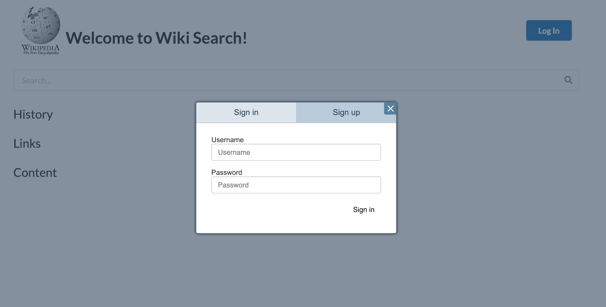
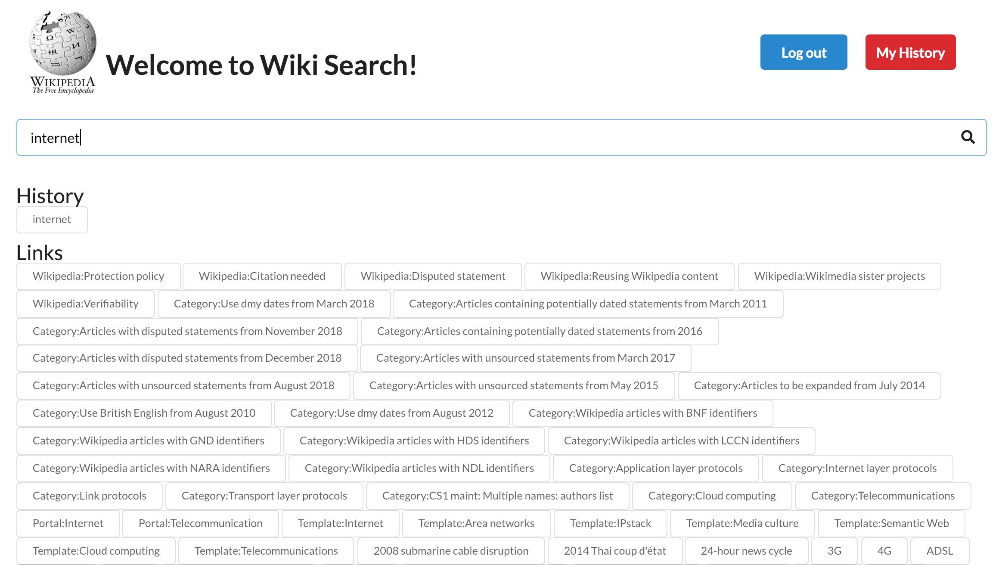
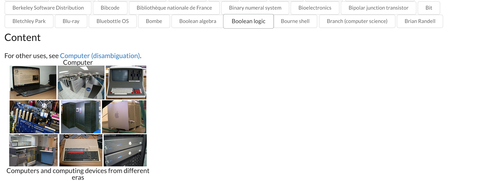

# [WikipediaAPI](https://wordict.herokuapp.com/)

This application supports user register. 
You can search in this website no matter you log in or not. 
You have a temporary history records on the webpage.
There is an inclusive feature for registered user: you can check out your search logs. Using this feature after you logging in, and there is a "My History" button rests in the right up corner of the webpage. 
You can click the content in the history or in the links section to search relevant content.

## Author
- [Freddy Lyu](https://freddydoesit.github.io/freddy/)

## Project Objective

The main feature of this app is conducted within 4 hours for the final exam. User register function is implemented during the extension hour to make it more practical.

<strong>I chose the option2: Use 24 hours and add users + db + deployment.</strong>

CS5610 Course Link: http://johnguerra.co/classes/webDevelopment_spring_2019/ 


## Screenshot





## Usage

First please make sure you have installed meteor, mongoDB, and React.

If you want to run it locally, follow this and run the following commands in your terminal.

```
git clone https://github.com/FreddyDoesIT/WikipediaAPI.git
cd WikipediaAPI
meteor npm install
meteor
```
Open your browser and visit http://localhost:3000 and you should see the application.

## Technologies

- Platform: [Meteor](https://www.meteor.com/) with React - An open source platform for 
web, mobile, and desktop.
- UI: [Semantic UI](https://semantic-ui.com/) - A development framework that helps create beautiful, responsive layouts using human-friendly HTML.
- JavaScript library: simpl-schema.js
- API: [node-wikipedia](https://www.npmjs.com/package/node-wikipedia) - An API for fetching data from Wikipedia.


## License
[](https://opensource.org/licenses/MIT)

This repository has the standard [MIT license](https://opensource.org/licenses/MIT). 